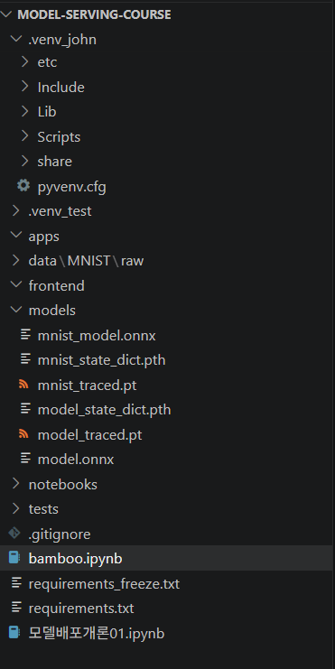

q1. 모델 학습은 데이터를 이용해 모델의 성능을 만드는 과정이고 모델 배포는 노트북파일안에 있는 모델을 실제 사용자가 사용할 수 있게 서비스 하는것.
q2. 프레임워크의 의존성문제, 라이브러리 버젼 문제
q3. 매번 의존성과 버젼 문제를 해결하기 위해 재설치 해주어야 한다. 충돌이 일어난다.
q4. 프리즈는 모든 패키지 목록을 다 복사해낸것이고 requirement는 필요한 부분만 환경설정 하도록 한다.
q5. 입력되는 데이터에 따라 추론이 달라지기 때문에 post 사용
q6. 200	성공	요청이 정상 처리됨
    400	클라이언트 오류	사용자가 잘못된 입력을 보냄
    500	서버 오류	서버 내부 코드나 모델 실행 중 문제가 발생함
q7.모델의 가중치 값만 저장하고, 모델 구조 자체는 저장하지 않기 때문입니다.
q8.ONNX의 가장 큰 장점은 학습 프레임워크에 덜 종속적인 표준 모델 포맷으로 변환할 수 있다는 점입니다.
q9. Dropout, BatchNorm 같은 레이어를 추론 모드로 전환하기 위해서입니다.
q10. 모델 추론 로직과 API 서버 코드를 분리해서 유지보수와 재사용성을 높이기 위해서입니다.