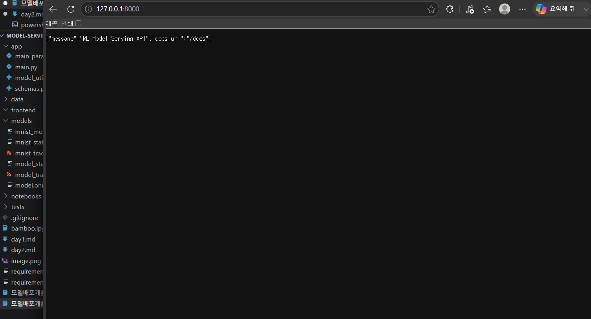
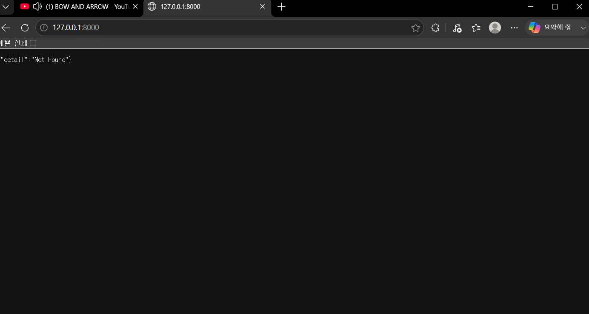
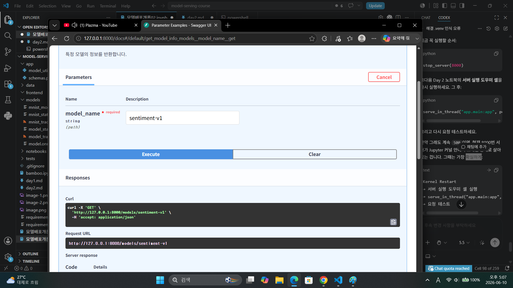
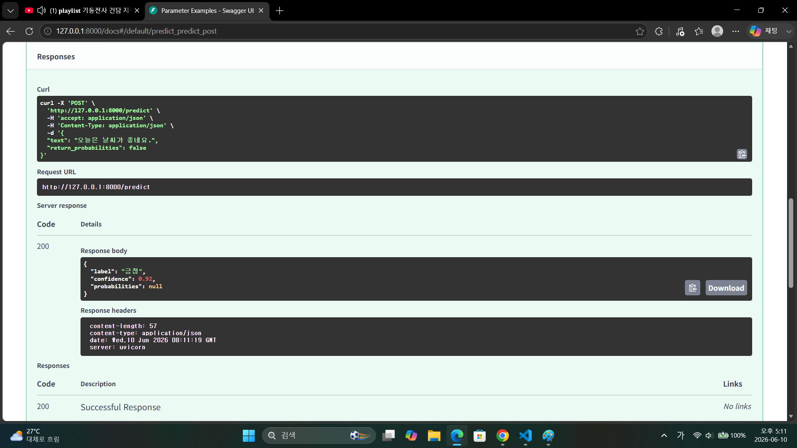
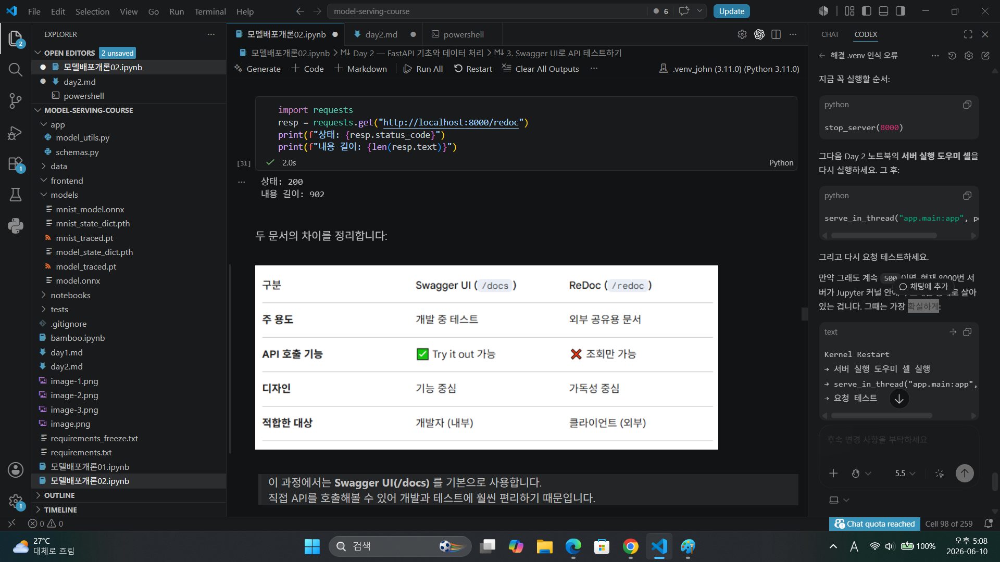
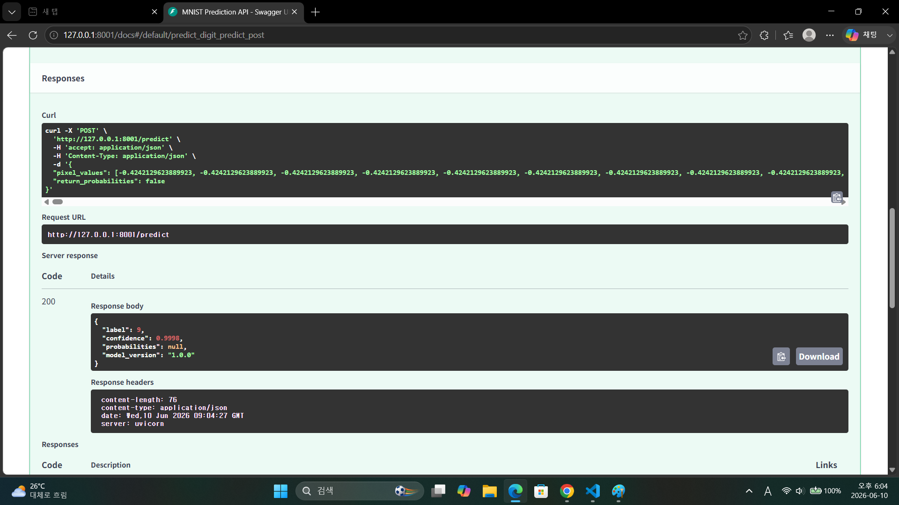

1.
2.
3.
model- try it out- sentiment-v1 입력후 execute

body text 입력후 post 결과 받기

redoc get 호출후 respone 받기
4.

1. FastAPI가 Flask보다 모델 배포에 적합한 이유 세 가지는 무엇입니까? 가볍고 빠르고 비동기형 서비스라서 개발하면서 바로바로 테스트하고 배포 안정성까지 체크 할 수 있다.
2. Uvicorn의 역할은 무엇이며, 왜 FastAPI와 함께 사용합니까?  HTTP 요청을 받아서 FastAPI에 전달하는 역할입니다. 비동기웹인 FastAPT와 잘 맞는 ASGI 서버 구현체라서
3. `@app.get("/health")`에서 `get`과 `"/health"`는 각각 무엇을 의미합니까? get은 HTTP GET 메서드를 의미하며, 서버의 정보를 조회할 때 사용합니다.
"/health"는 API의 경로를 의미하며, 서버 상태나 모델 로드 여부를 확인하는 헬스체크 엔드포인트입니다.
4. FastAPI에서 dict를 반환하면 어떤 일이 자동으로 일어납니까? FastAPI가 그 딕셔너리를 자동으로 JSON 응답으로 변환해서 클라이언트에게 보내줍니다.

1. /models/sentiment-v1에서 sentiment-v1은 어떤 종류의 파라미터입니까? path 파라미터이고 URL 경로 안에 들어가서 특정 리소스를 식별하는 값입니다
2. /models?status=running&limit=5에서 status와 limit은 어떤 종류의 파라미터입니까? query 파라미터
3. 모델 추론 요청에 Request Body를 사용하는 이유는 무엇입니까? 추론 요청에는 입력 데이터가 들어가는데 문장이 길어질수도 있고 여러 필드를 포함할 수도 있습니다. JSON 형식으로 명확하게 검증도 하고 데이터를 서버에 보내 처리하는 작업에 적합하기 때문입니다.
4. FastAPI에서 함수의 파라미터가 Path, Query, Body 중 어디서 오는지 어떻게 판별합니까? URL 경로에 {}로 선언되어 있으면 Path 파라미터... 함수 파라미터가 기본 자료형이면 Query 파라미터... Pydantic 모델이면 Request Body...

1. FastAPI에서 Swagger UI에 접속하려면 어떤 URL로 이동합니까? http://127.0.0.1:8000/docs
2. Swagger UI가 코드와 항상 동기화될 수 있는 이유는 무엇입니까? FastAPI가 코드에 정의된 내용을 바탕으로 OpenAPI 스키마를 자동 생성하기 때문이다.
3. Pydantic 모델의 `Field(description=, examples=)`는 Swagger UI의 어디에 반영됩니까? 요청 Body의 Schema 설명 부분에 반영됩니다.
4. Swagger UI와 ReDoc의 핵심 차이는 무엇입니까? 주소가 /docs , /redoc로 차이남
api를 직접 실행해 볼수 있어 테스트 중심임 후자는 문서열람 중심... 

1. `text: str`과 `text: str = "기본값"`의 차이는 무엇입니까? 전자는 요청값을 안 입력하면 에러가 남... 후자는 입력이 안 해도 기본값이 들어감
2. `Field(..., min_length=1, max_length=5000)`에서 `...`은 무엇을 의미합니까? ...필드는 필수값이다. text는 반드시 있어야 한다. 문자열이어야 하며 최소 1글자 이상이어야 하고 최대 5000글자 이하여야 한다.
3. 422 에러 응답에서 `loc` 필드는 어떤 정보를 담고 있습니까? 에러가 발생한 위치를 알려준다.
4. `response_model`을 지정하면 어떤 이점이 있습니까?
1. 응답 형식을 명확하게 고정할 수 있다.
2. 잘못된 응답 타입을 검증할 수 있다.
3. Swagger UI 문서에 응답 구조가 자동으로 표시된다.
4. 불필요한 내부 필드가 노출되는 것을 막을 수 있다.
5. 프론트엔드나 API 사용자 입장에서 응답 예측이 쉬워진다.

1. 모델을 서버 시작 시 한 번만 로드해야 하는 이유는 무엇입니까?  모델 로드는 시간이 오래 걸리고 비용이 큰 작업이기 때문입니다.
2. pixel_values가 784개가 아닌 요청이 들어오면 어떤 일이 발생합니까? 이를 처리하는 코드를 직접 작성했습니까? 요청이 맞지 않을 경우 422 에러 발생
3. HTTPException(status_code=503)은 어떤 상황에서 사용했습니까? 왜 500이 아니라 503입니까? 코드에서는 모델이 로드되지 않았을 때 503을 사용했습니다. 서버는 살아있으나 모델이 준비가 되지않아서 추론이 불가능 하기 때문입니다.
4. Swagger UI에서 PredictRequest의 description과 examples가 어디에 표시됩니까?swagger UI의 /predict 엔드포인트 안에서 Request body Schema 영역에 표시됩니다.
