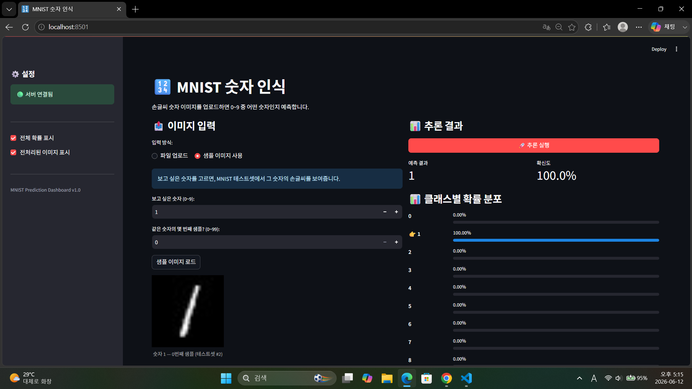

1. Streamlit의 스크립트 재실행 모델이란 무엇입니까? 그런데 사용자가 위젯을 조작하거나 코드가 바뀌면, Streamlit은 변경된 부분만 함수처럼 다시 실행하는 것이 아니라 전체 스크립트를 처음부터 끝까지 다시 실행합니다.
2. `st.text_input()`에 값을 입력하면 내부적으로 어떤 일이 일어납니까? 입력한 text가 name변수에 콜백 됩니다.
3. `st.set_page_config()`를 스크립트 중간에 호출하면 어떻게 됩니까?

1. `st.file_uploader()`로 업로드된 파일의 바이트 데이터는 어떻게 얻습니까? st.file_uploader()는 업로드된 파일을 UploadedFile 객체로 반환합니다. 이 객체는 파일처럼 다룰 수 있고, 바이트 데이터는 보통 .getvalue()로 얻습니다. 공식 문서도 업로드 파일은 Python 메모리의 BytesIO 버퍼에 담긴다고 설명합니다
2. Streamlit에서 `@st.cache_resource`를 사용하는 이유는 무엇입니까? Streamlit은 이벤트마다 스크립트를 재실행한다고 했습니다. 매번 재실행할 때마다 객체를 다시 생성하면 느려지므로, **한 번만 생성하고 재사용**하는 캐시가 필요합니다

1. 모놀리식과 분리 아키텍처의 핵심 차이를 한 문장으로 설명하세요. 모놀리식은 화면, API, 모델 추론 코드가 하나의 앱 안에 함께 있는 구조이고, 분리 아키텍처는 Streamlit 화면 서버와 FastAPI 모델 추론 서버를 분리한 구조입니다.
2. 모델을 업데이트할 때, 분리 아키텍처에서는 어떤 서버만 재배포하면 됩니까? 모델이 들어 있는 FastAPI 추론 서버만 재배포하면 됩니다.
3. Streamlit 앱에 PyTorch가 설치되어 있지 않아도 되는 이유는 무엇입니까? 분리 아키텍처에서는 PyTorch 모델을 직접 실행하는 곳이 Streamlit이 아니라 FastAPI 서버이기 때문입니다.

1. 이미지를 API에 전송할 때 Base64로 인코딩하는 이유는 무엇입니까? 이미지 파일은 원래 바이너리 데이터입니다. 그런데 JSON 요청 본문은 기본적으로 문자열, 숫자, 배열, 객체 같은 텍스트 기반 데이터를 주고받는 형식입니다. 그래서 이미지를 JSON 안에 넣어 API로 보내려면, 이미지의 바이트 데이터를 문자열 형태로 바꿔야 합니다. 이때 사용하는 대표적인 방식이 Base64 인코딩입니다.
2. `response.raise_for_status()`는 어떤 역할을 합니까? response.raise_for_status()는 HTTP 응답 상태 코드가 오류 코드인지 확인하고, 오류라면 예외를 발생시키는 함수입니다. 예외처리를 통해 프로덕트가 다운되는 상황을 막고 디버깅을 할 수 있게 한다.

[섹션 1: Streamlit 소개]
Q1. Streamlit의 스크립트 재실행 모델이란?

[섹션 2: 핵심 컨셉]
Q2. @st.cache_resource를 사용하는 이유는?

[섹션 3: System Architecture]
Q3. 프론트엔드와 백엔드를 분리하는 핵심 이유 두 가지는? 프론트엔드와 백엔드를 분리하는 이유는 화면 처리와 모델 추론의 역할을 나누고, 각 부분을 독립적으로 수정·배포·확장하기 위해서입니다.
역할 분리
프론트엔드는 화면과 사용자 입력을 담당하고,
백엔드는 모델 추론, 데이터 처리, API 응답을 담당합니다.
그래서 UI 코드와 모델 서버 코드를 따로 관리할 수 있습니다.
배포와 확장성 향상
모델을 수정하면 백엔드만 재배포하면 되고,
화면을 수정하면 프론트엔드만 수정하면 됩니다.
또한 프론트엔드 서버에 PyTorch 같은 무거운 모델 라이브러리를 설치하지 않아도 됩니다.
Q4. Streamlit 앱에 PyTorch가 필요 없는 이유는?

[섹션 4: API 호출]
Q5. API 호출 실패 시 사용자에게 스택 트레이스가 아닌 메시지를 보여줘야 하는 이유는?

[섹션 5: 실습]
Q6. st.session_state에 결과를 저장하는 이유는? Streamlit이 입력이나 버튼 클릭 때마다 스크립트를 처음부터 다시 실행하기 때문입니다. 재실행되어도 이전 결과를 유지해서 사용자 화면에 계속 보여주기 위해 사용합니다.

