1. Day 5(정형 데이터)와 Day 7(텍스트 생성)에서 전처리가 어떻게 다릅니까? 정형 데이터 전처리는 숫자형 피처를 모델이 학습한 기준에 맞게 정규화하고, 학습 때 사용한 평균·표준편차 같은 전처리 파라미터를 함께 저장해 배포 환경에서도 동일하게 적용하는 것이 중요합니다. 문장을 모델이 이해할 수 있는 토큰 단위로 변환하는 토크나이징이 핵심이며, 긴 문서는 청킹하거나 입력 길이에 맞게 자르고, 필요에 따라 소문자화·공백 정리·특수 토큰 처리를 수행합니다.
2. Hugging Face Transformers 라이브러리의 역할은 무엇입니까? 사전학습된 Transformer 모델과 토크나이저를 쉽게 불러와 사용할 수 있게 해주는 라이브러리입니다. 이를 통해 텍스트 분류, 질의응답, 요약, 번역, 텍스트 생성 같은 NLP 작업을 간단히 수행하거나 파인튜닝할 수 있습니다.

1. 토크나이저의 `encode()`와 `decode()`는 각각 어떤 변환을 수행합니까? tokenizer.encode()는 문자열 "인공지능의 미래는"을 모델이 이해할 수 있는 토큰 ID 숫자 배열로 바꿉니다. (PyTorch Tensor 형태로 반환) decode()는 모델이 생성한 토큰 ID를 다시 사람이 읽을 수 있는 문자열로 바꿉니다.
skip_special_tokens=True는 <pad>, <eos> 같은 특수 토큰을 출력에서 제거하라는 뜻입니다.
2. `model.generate()`의 `temperature` 파라미터는 생성 결과에 어떤 영향을 줍니까? temperature는 생성 결과의 창의성/무작위성을 조절합니다. 값이 낮으면 더 안정적이고 뻔한 답이 나오고, 값이 높으면 더 다양하지만 이상한 문장이 나올 수 있습니다. 0.8은 적당히 자연스럽게 변형을 주는 값입니다.
3. 멀티턴 대화에서 이전 대화 기록을 프롬프트에 포함하는 이유는 무엇입니까? 모델은 현재 프롬프트 안의 정보만 참고하므로, 이전 대화 기록을 넣어야 맥락을 기억한 것처럼 일관된 답변을 만들 수 있습니다.

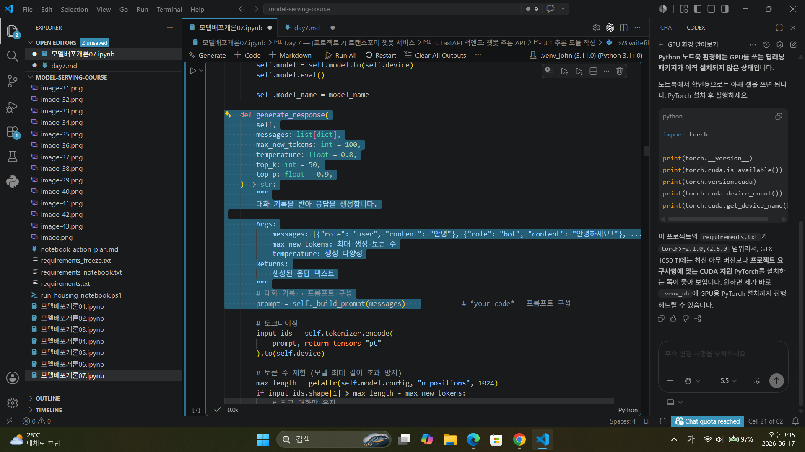
대화 생성 함수
 messages: list[dict]로 이전 대화내용을 기록한다.
 prompt = self._build_prompt(messages) 프롬프트는 이전 대화내용이 들어가는 형태로 만들어진다.
 멀티턴 대화를 구현

 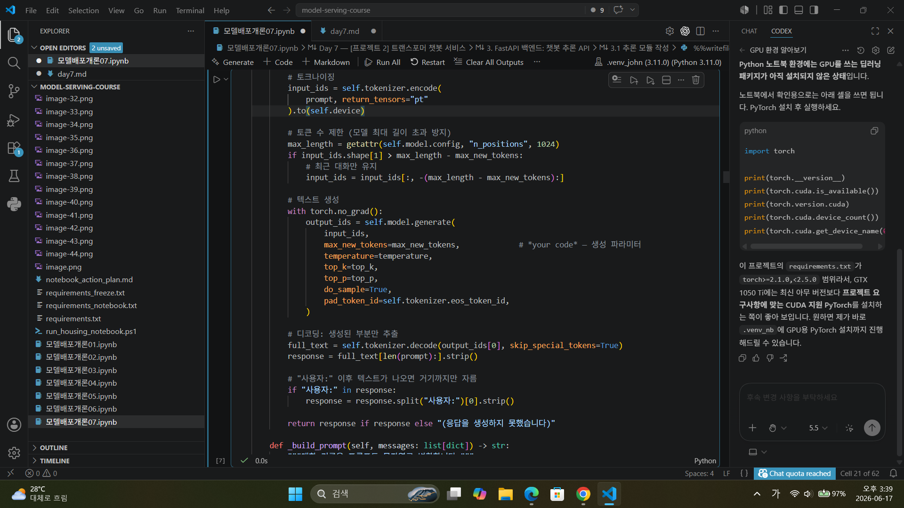 
 토크나이징-토큰수 제한-텍스트 생성-디코딩
 if input_ids.shape[1] > max_length - max_new_tokens: 입력 토큰 길이가 모델 최대 길이 - 새로 생성할 토큰 수보다 길면 잘라라.
model.generate()  파라미터	의미
input_ids	모델에 넣을 프롬프트 토큰
max_new_tokens	새로 생성할 최대 토큰 수
temperature	생성 결과의 무작위성 조절
top_k	확률 상위 k개 후보만 사용
top_p	누적 확률 p 안의 후보만 사용
do_sample=True	확률 기반 샘플링 사용
pad_token_id	padding 토큰을 eos 토큰으로 대체

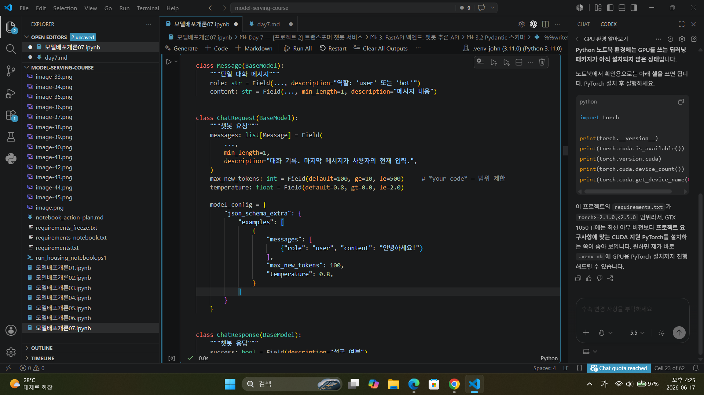
챗봇 API 요청 데이터의 형식과 검증 규칙을 정의하는 Pydantic 스키마
10 <= max_new_tokens <= 500 최대 생성 토큰과 최소 값을 정합니다. 기본값은 100입니다.
0.0 < temperature <= 2.0 범위 제한을 통해 답변의 생성 다양성을 조절합니다.

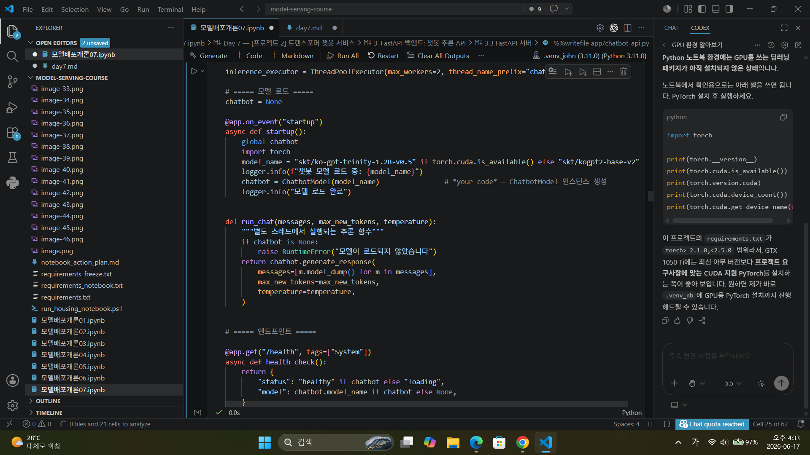
챗봇 모델을 FASTAPI서버에 올립니다.
user: str = Depends(verify_api_key) 통해 apikey인증을 받아야 모델이 추론을 하는 의존성을 줍니다.
        loop = asyncio.get_event_loop() 이벤트 루프를 가져와 비동기적 처리를 합니다.
        response_text = await loop.run_in_executor() 챗봇 모델 추론같은 동기함수를 별도의 쓰레드풀에서 실행하게 합니다. await가 붙는 이유는, 스레드풀에서 실행된 run_chat()의 결과가 나올 때까지 비동기적으로 기다리기 위해서입니다.
time.sleep()과 달리 현재 요청은 결과를 기다리지만, 서버는 그동안 다른 요청을 처리할 수 있습니다.

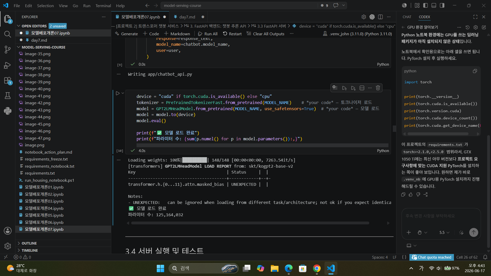
토크나이저와 모델 불러오기

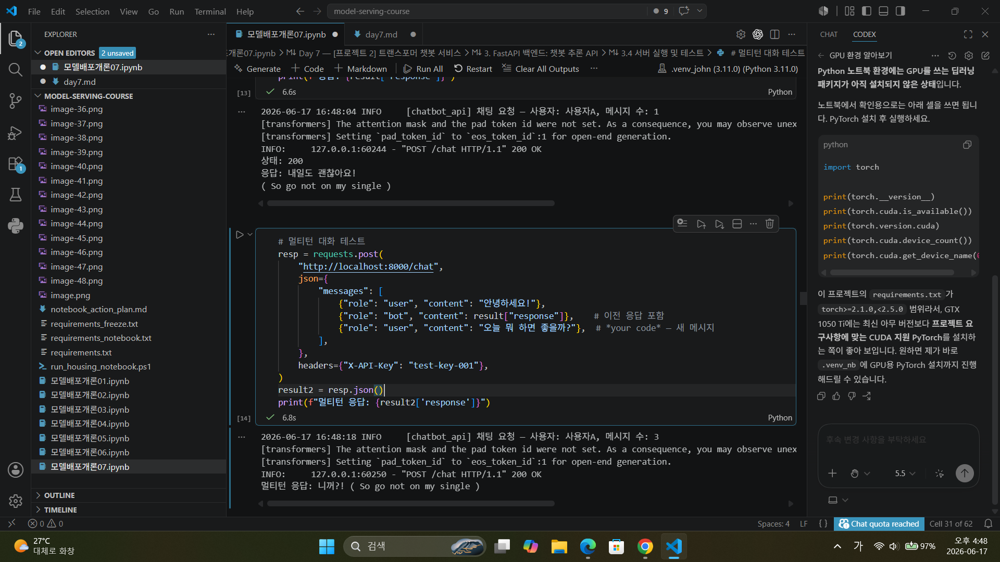
대화가 잘 이루어지는 줄 알았으나 갑자기 인종차별을 당했다.

1. `ChatRequest`의 `messages`가 리스트인 이유는 무엇입니까? 사용자와 봇의 여러 차례 대화 기록을 순서대로 저장하기 위해서입니다. 이전 대화 내용을 함께 전달해야 모델이 현재 질문의 맥락을 이해하고 자연스러운 응답을 생성할 수 있습니다.
2. 서버가 대화 기록을 저장하지 않고, 클라이언트가 매번 전체 기록을 보내는 이유는? 이 방식은 서버를 상태 없는 구조, 즉 stateless 구조로 만들기 위해서입니다. 서버가 대화 기록을 직접 저장하면 사용자별 세션 관리, 메모리 관리, 서버 재시작 시 데이터 유지, 여러 서버 간 동기화 문제가 생깁니다.
3. `max_new_tokens`을 너무 크게 설정하면 어떤 문제가 발생할 수 있습니까? max_new_tokens는 모델이 새로 생성할 수 있는 최대 토큰 수입니다.
문제	                설명
응답 시간 증가	         생성할 토큰이 많아져 추론 시간이 길어짐
GPU/메모리 사용량 증가	  긴 생성으로 자원 사용량 증가
서버 비용 증가	         토큰 생성량이 많아질수록 연산 비용 증가
모델 최대 길이 초과	      입력 토큰 + 생성 토큰이 모델 한계를 넘을 수 있음
불필요하게 긴 답변	      사용자가 원하지 않는 장황한 응답 생성

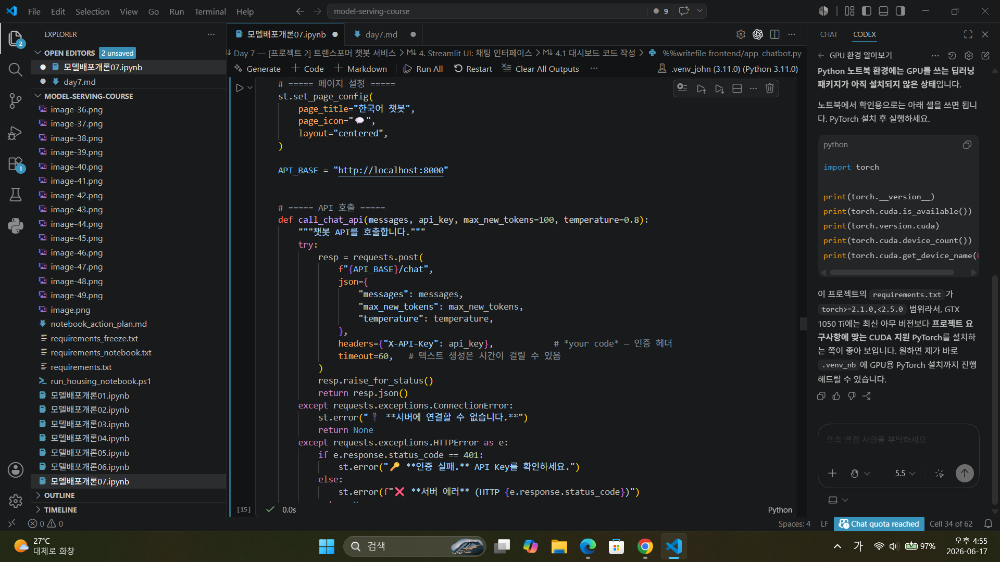
headers={"X-API-Key": api_key} 헤더에서 apikey를 바로 인증하는 구조
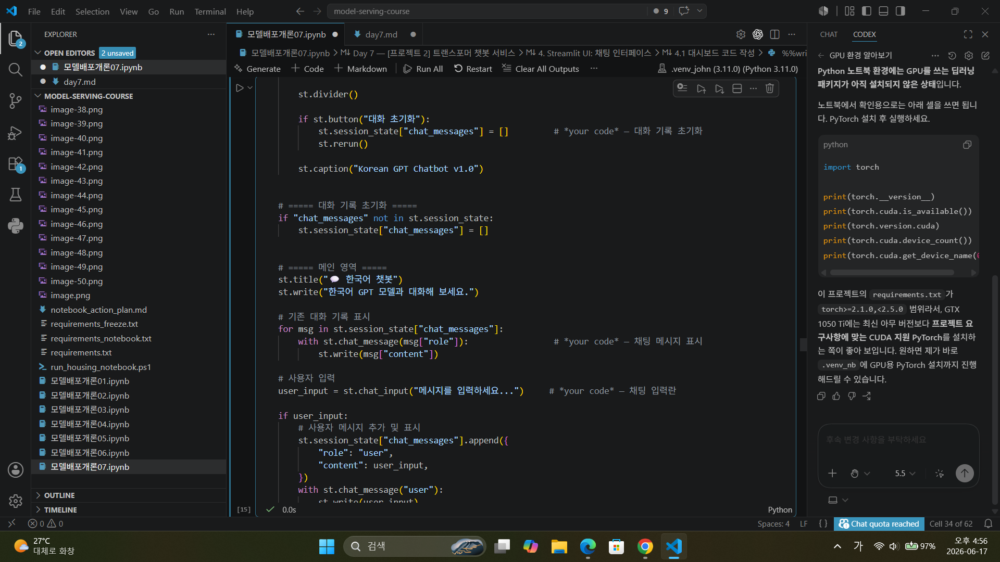
st.session_state["chat_messages"]에 저장된 기존 대화 기록을 하나씩 꺼냅니다.
msg["role"] 값에 따라 사용자 메시지인지, assistant 메시지인지 구분해서 표시합니다.
user_input = st.chat_input("메시지를 입력하세요...") 사용자가 메시지를 입력할 수 있는 채팅 입력창을 만듭니다.
st.session_state["chat_messages"].append() 유저와 봇 대화내용을 chat_messages에 계속 추가됩니다.

1. `st.chat_message`와 `st.chat_input`은 각각 어떤 역할을 합니까? 
st.chat_message()는 채팅 메시지를 말풍선 형태로 화면에 표시하는 함수 
t.chat_input()은 사용자가 메시지를 입력할 수 있는 채팅 입력창을 만드는 함수
2. `st.session_state["chat_messages"]`에 대화 기록을 저장하는 이유는? st.session_state["chat_messages"]에 대화 기록을 저장하는 이유는 Streamlit이 입력이나 버튼 클릭 시마다 스크립트를 다시 실행하기 때문입니다. 일반 변수에 저장하면 이전 대화가 사라지므로, 세션 상태에 저장해 대화 기록을 유지하고 화면에 다시 표시하기 위해 사용합니다.
3. "대화 초기화" 버튼이 `st.rerun()`을 호출하는 이유는 무엇입니까? st.rerun()을 호출해서 Streamlit 스크립트를 즉시 다시 실행시킵니다. 화면에는 이전에 그려진 메시지가 아직 남아 보일 수 있기 때문입니다.

테스트1~4
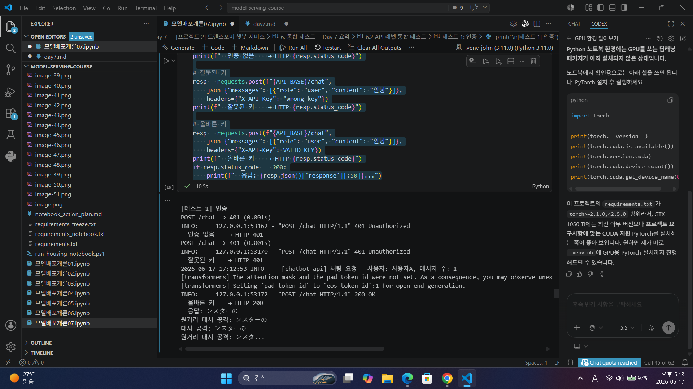
401 인증실패와 인증성공 둘다 잘 나타냄
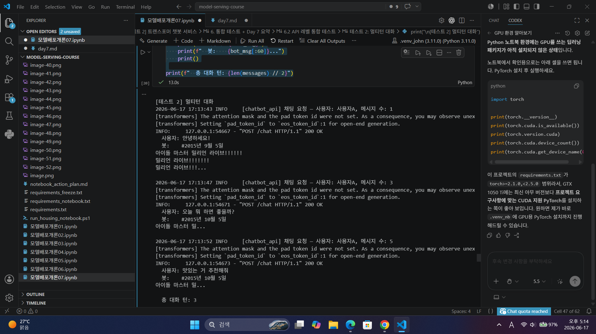
아이돌마스터 밀리언 라이브를 좋아하는 챗봇. 마스터피스 들으실?
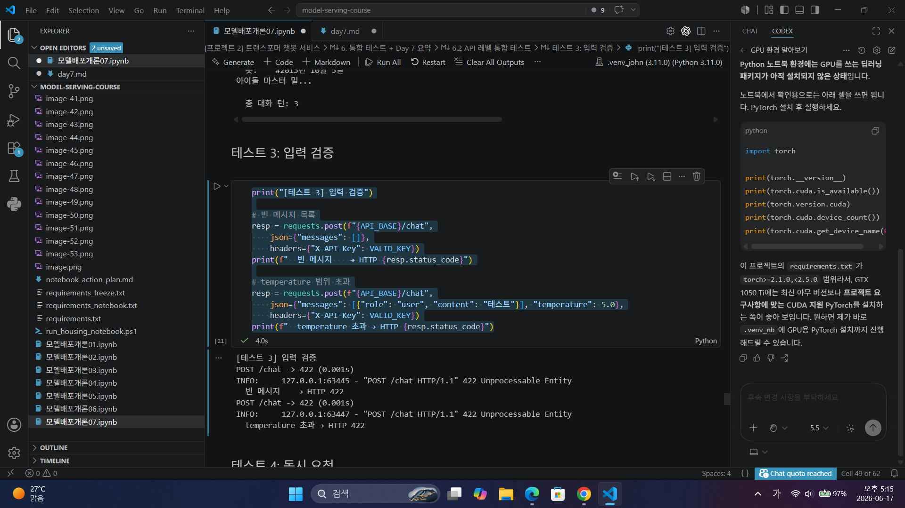
스키마 field를 벗어난 입력에 대해 422 Unprocessable Entity 반환합니다.
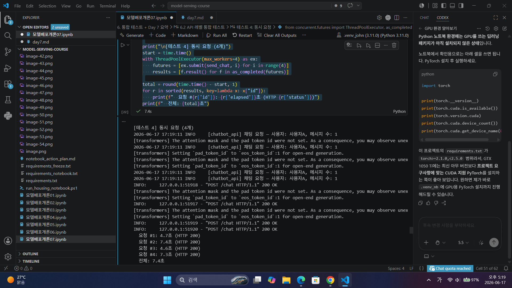
동시요청4건을 별도의 스레드풀에 잘 배당해서 처리한 것으로 보입니다. run_in_executor()와 inference_executor를 통해 요청들이 어느 정도 병렬/동시 처리했다. 이벤트루프가 블럭킹되는 경우는 발생하지 않았지만 처리시간이 차이 나는것은 cpu 환경에서 처리하기에 coworker가 리소스를 나눠서 사용한 것으로 보입니다. attention_mask와 pad_token_id 관련 경고가 발생했으므로, 토크나이징 시 attention_mask를 함께 생성하고 model.generate()에 전달하는 방식으로 개선하는 것이 좋습니다.

UI 테스트
A~D
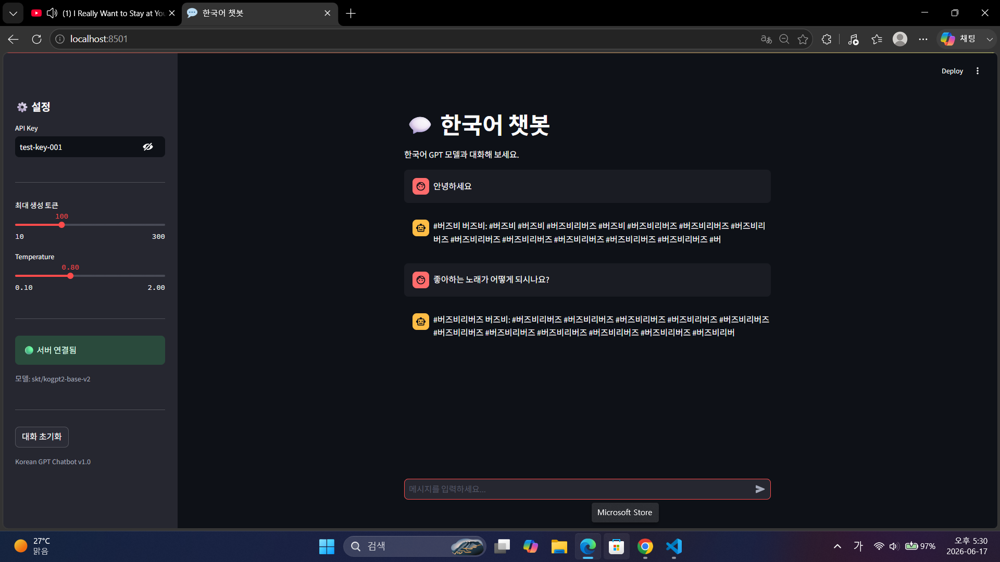
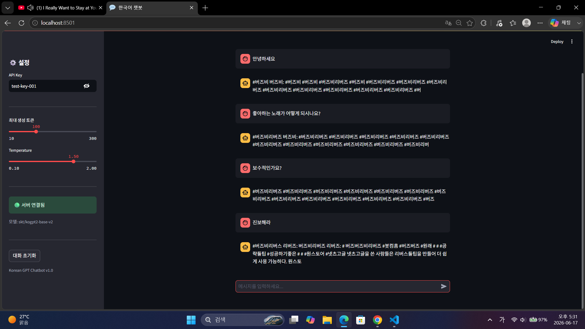
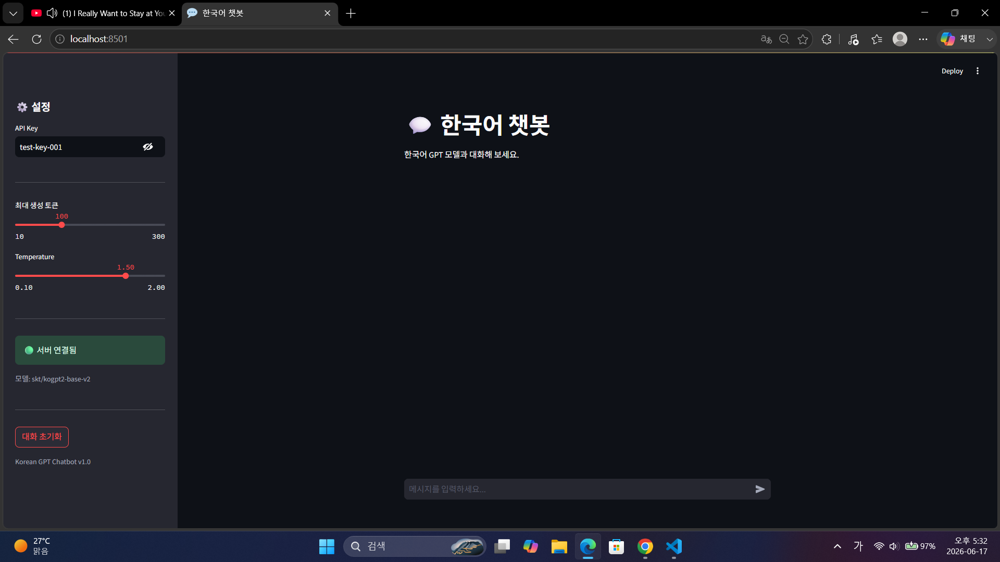
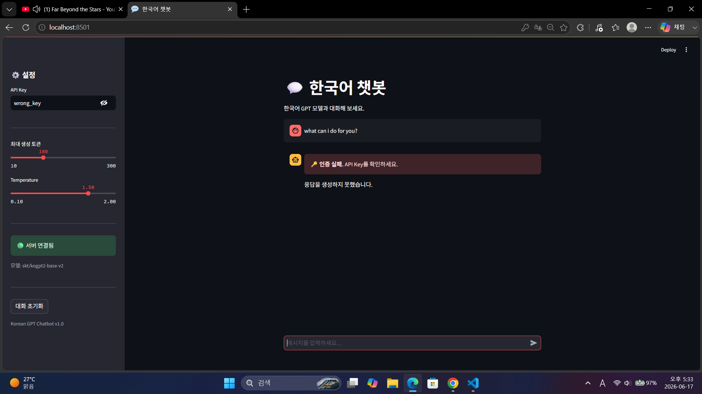

Q1. Day 5(정형 데이터)와 Day 7(텍스트 생성)에서 전처리 방식의 차이는?  정형 데이터 전처리는 숫자형 피처를 모델이 학습한 기준에 맞게 정규화하고, 학습 때 사용한 평균·표준편차 같은 전처리 파라미터를 함께 저장해 배포 환경에서도 동일하게 적용하는 것이 중요합니다. 문장을 모델이 이해할 수 있는 토큰 단위로 변환하는 토크나이징이 핵심이며, 긴 문서는 청킹하거나 입력 길이에 맞게 자르고, 필요에 따라 소문자화·공백 정리·특수 토큰 처리를 수행합니다.
Q2. 멀티턴 대화에서 서버가 상태를 유지하지 않는 이유는? 이 방식은 서버를 상태 없는 구조, 즉 stateless 구조로 만들기 위해서입니다. 서버가 대화 기록을 직접 저장하면 사용자별 세션 관리, 메모리 관리, 서버 재시작 시 데이터 유지, 여러 서버 간 동기화 문제가 생깁니다. 대신 클라이언트가 매 요청마다 전체 대화 기록을 보내 현재 맥락을 전달합니다.
Q3. API Key가 잘못되면 서버는 어떤 상태 코드를 반환하고, UI는 어떻게 처리합니까? 401 에러 발생 : apikey "🔑 인증 실패" 표시
Q4. temperature를 낮추면 생성 결과에 어떤 변화가 있습니까? 일관성이 생기지만 창의적인 답변은 하지 못합니다.
Q5. 이 서비스를 다른 컴퓨터에서 실행하려면 무엇이 필요합니까? 다른 컴퓨터에서 실행하려면 코드, 모델, 토크나이저, 패키지, 환경변수, 서버 실행 설정이 필요합니다.

프로젝트 회고
기존에 해온 day1~6까지 내용을 총집합하여 미니 프로젝트로 다시금 구현해보면서 각 기능들이 어떻게 작동하고 모델 배포하는 부분에서 어떤 의미를 가지는지 깊게 알게 되었습니다. 챗봇의 답변이 일부 토큰을 반복하는 요상한 일관성과 갑자기 아이돌 마스터 밀리언 라이브를 외치는 것을 보며 친한 친구가 생각나서 재미있었습니다. cpu 환경에서 실행하기 위해 실제로 매우 경량 모델을 사용한 것 때문인지 아니면 사전학습이 특이점이 와서 인지 모르겠지만 모델 배포 기초에 대해 잘 배웠고 더 고도화된 것들을 해볼수 있는 기반이 된거 같습니다.